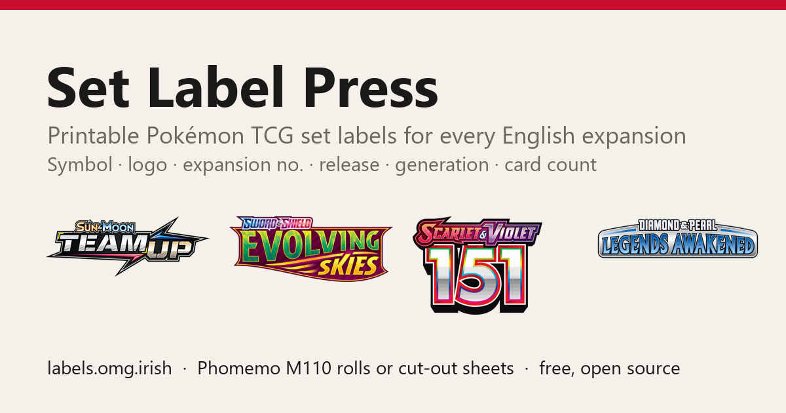

# Set Label Press — Pokémon TCG set labels

**Live: https://labels.omg.irish/**

Printable labels for every English Pokémon TCG expansion, for binders, storage boxes and dividers.
Each label carries the set symbol, the HD set logo, the expansion number, release date, generation and card
count (secret rares included). Print one label per page on a Phomemo M110 label roll, or lay them out at
true size on Letter / A4 / 3×5 index cards for a color printer and cut them out.

Runs entirely in the browser. No accounts, no tracking, no server-side anything: it is a static site.



## Using it

1. Tick the sets you want (search, filter by series, or "New since 2023").
2. Pick a label size (M110 rolls, half an index card, or a custom size).
3. Check the preview: one label, the whole roll, or the exact pages of a sheet.
4. **Print labels** (label printer, one label per page) or **Print sheet** (color printer, cut guides).

Settings are saved in your browser only.

## Layout

```
public/            the site, deployed as-is to Cloudflare Workers (static assets)
  index.html       app + all styling and logic
  sets.js          data snapshot: name, series, type, Bulbapedia set code, abbreviation, sequential
                   expansion number, release date, printed + secret card counts, set symbol (data URI),
                   logo path, "printed in the 2023 batch" flag
  img/logos/       set logos (1000 px wide, 256 colours)
pipeline/          regeneration scripts (Python 3, Pillow)
wrangler.toml      Cloudflare Workers config (custom domain labels.omg.irish)
```

## Regenerating the data when new sets ship

```
cd pipeline
curl -A "Mozilla/5.0" -o bulba_expansions.html "https://bulbapedia.bulbagarden.net/wiki/List_of_Pok%C3%A9mon_Trading_Card_Game_expansions"
curl -o sets_p1.json "https://api.pokemontcg.io/v2/sets?pageSize=250&orderBy=releaseDate"
python parse_bulba.py      # tables -> bulba_raw.json
python build_data.py       # normalise, number, fix rowspan-shifted rows -> sets_data.json
python fetch_images.py     # download + resize symbols and logos (skips files already present)
python make_setsjs.py      # writes ../public/sets.js and ../public/img/logos/
```

Numbering: main-series expansions and special expansions are counted on separate sequential counters,
matching the 2023 index-card batch (Legends Awakened 37, Team Up 79, Silver Tempest 94; Dragon Vault
special 1). `docx_abbrs.json` is the abbreviation list from that batch and drives the "New since 2023"
filter.

## Deploying

```
npx wrangler deploy
```

## Data and artwork

Set data and artwork come from [Bulbapedia's list of Pokémon TCG expansions](https://bulbapedia.bulbagarden.net/wiki/List_of_Pok%C3%A9mon_Trading_Card_Game_expansions)
(CC BY-NC-SA) with Base Set artwork from [pokemontcg.io](https://pokemontcg.io/).

Pokémon and all set names, symbols and logos are trademarks of Nintendo, Creatures Inc. and GAME FREAK inc.
This is an unofficial fan-made tool for personal, non-commercial use and is not affiliated with or endorsed by
The Pokémon Company.

## License

Code: MIT. Artwork remains the property of its owners as noted above.
